# Visualized-GTest-Platform
可视化的谷歌测试框架用例执行平台。（Visualized Google Test Framework Case Execution Platform.）


本项目分两部分展开：
1. GTest-Framework 是一个现代化的 C++ 测试框架，展示如何使用 Google Test 高效测试 DLL/exe 模块。本项目提供了一个灵活且可扩展的架构，用于测试基于 DLL/exe 的应用程序。
2. Visualized-Platform 是一个基于 Qt5 的自动测试运行器和 Google Test 单元测试的图形用户界面。 可以将 GTest-Framework 中生成的 exe 文件加载进该项目中，进行可视化单元测试。


那么本指导也分两块进行阐述，感兴趣的读者可以有选择的阅读：

# 目录
<!-- TOC -->

- [目录](#目录)
- [GTest-Framework 简介](#GTest-Framework简介)
- [✨ 特性](#-特性)
- [🚀 快速开始](#-快速开始)
  - [环境要求](#环境要求)
  - [构建项目](#构建项目)
- [运行测试](#运行测试)
  - [常用过滤器模式](#常用过滤器模式)
  - [环境变量](#环境变量)
  - [调试选项](#调试选项)
- [📖 文档](#-文档)
  - [项目结构](#项目结构)
  - [添加新的模块测试](#添加新的模块测试)
- [Visualized-GTest-Platform 简介](#Visualized-GTest-Platform简介)
  - [自动测试运行](#自动测试运行)
  - [简单的交通灯输出](#简单的交通灯输出)
  - [完整的控制台输出](#完整的控制台输出)
  - [完全可定制的布局](#完全可定制的布局)
  - [明暗主题](#明暗主题)
  - [系统通知](#系统通知)
  - [Gtest 支持](#gtest-支持)
- [测试可执行文件面板](#测试可执行文件面板)
  - [拖放支持](#拖放支持)
  - [轻松添加和删除测试](#轻松添加和删除测试)
  - [重新运行测试](#重新运行测试)
  - [终止测试](#终止测试)
  - [gtest 命令行选项](#gtest-命令行选项)
  - [启用/禁用自动运行](#启用禁用自动运行)
  - [测试进度](#测试进度)
  - [测试路径提示](#测试路径提示)
- [测试用例窗口](#测试用例窗口)
  - [详细的失败信息](#详细的失败信息)
  - [失败排序](#失败排序)
  - [失败过滤](#失败过滤)
- [失败窗口](#失败窗口)
  - [跳转到控制台输出](#跳转到控制台输出)
  - [在 IDE 中打开](#在-ide-中打开)
  - [完整的 GTest 错误消息](#完整的-gtest-错误消息)
- [控制台窗口](#控制台窗口)
  - [搜索](#搜索)
  - [下一个/上一个失败](#下一个上一个失败)
  - [清除之前运行的输出](#清除之前运行的输出)
  - [Cout](#cout)
- [🤝 贡献](#-贡献)
- [📄 许可证](#-许可证)
- [🌟 Star 历史](#-star-历史)
- [🙏 致谢](#-致谢)

<!-- /TOC -->

# GTest-Framework简介
GTest-Framework 是一个现代化的 C++ 测试框架，展示如何使用 Google Test 高效测试 DLL/exe 模块。本项目提供了一个灵活且可扩展的架构，用于测试基于 DLL/exe 的应用程序。

## ✨ 特性

- 🔌 每个模块独立的测试可执行文件
- 🎯 模块化的测试组织
- 📊 层次化的测试结果显示
- 🛠️ 简单易用的命令行界面
- 🔍 灵活的测试过滤功能
- 📦 基于 CMake 的构建系统

## 🚀 快速开始

### 环境要求

- CMake 3.20 或更高版本
- Visual Studio 2022 (Windows)
- 支持 C++14 的编译器

### 构建项目
1. 克隆仓库：
   ```bash
   git clone https://github.com/lemoabc/Visualized-GTest-Platform.git
   cd Visualized-GTest-Platform
   ```
2. 创建构建目录：
   ```bash
   mkdir build
   cd build
   ```
3. 配置并构建：
   ```bash
   cmake -B build -G "Visual Studio 17 2022" -A x64 -DCMAKE_BUILD_TYPE=Release
   cmake --build build --config Release
   ```
4. 安装：
   ```bash
   cmake --install . --prefix ./install
   ```

## 运行测试

每个模块都有自己的测试可执行文件，支持所有 Google Test 命令行选项：

1. 运行 ModuleA 测试：
```bash
ModuleATest.exe [gtest_options]
```

2. 运行 ModuleB 测试：
```bash
ModuleBTest.exe [gtest_options]
```

3. 运行特定测试：
```bash
test_runner.exe --gtest_filter=TestSuite.TestCase
```

4. 运行测试套件中的所有测试：
```bash
test_runner.exe --gtest_filter=TestSuite.*
```

5. 使用模式匹配运行测试：
```bash
test_runner.exe --gtest_filter=Foo*.*      # 运行所有以 'Foo' 开头的测试套件中的测试
test_runner.exe --gtest_filter=*.Test      # 运行所有以 'Test' 结尾的测试
test_runner.exe --gtest_filter=Foo.*:Bar.* # 运行多个测试套件中的测试
```

6. 排除特定测试：
```bash
test_runner.exe --gtest_filter=*-TestSuite.TestCase
```

7. 重复运行测试：
```bash
test_runner.exe --gtest_repeat=3           # 运行测试 3 次
test_runner.exe --gtest_repeat=-1          # 无限重复运行测试
```

8. 在失败时中断：
```bash
test_runner.exe --gtest_break_on_failure   # 测试失败时触发调试器中断
```

9. 生成 XML 报告：
```bash
test_runner.exe --gtest_output=xml:report.xml
```

10. 显示测试执行时间：
```bash
test_runner.exe --gtest_print_time=1
```

11. 随机顺序运行测试：
```bash
test_runner.exe --gtest_shuffle            # 随机顺序
test_runner.exe --gtest_random_seed=1234   # 指定随机种子
```

12. 组合多个选项：
```bash
test_runner.exe --gtest_filter=TestSuite.* --gtest_repeat=3 --gtest_shuffle
```

13. 显示帮助和可用选项：
```bash
test_runner.exe --help
# 或
test_runner.exe --gtest_help
```

### 常用过滤器模式

- `TestSuite.*` - TestSuite 中的所有测试
- `*Test.*` - 所有以 "Test" 结尾的测试套件中的测试
- `TestSuite.Test*` - TestSuite 中所有以 "Test" 开头的测试
- `TestSuite.*-TestSuite.Test1` - TestSuite 中除了 Test1 的所有测试
- `TestSuite1.*:TestSuite2.*` - TestSuite1 和 TestSuite2 中的所有测试

### 环境变量

你也可以使用环境变量设置测试选项：

```bash
set GTEST_FILTER=TestSuite.*
set GTEST_REPEAT=3
set GTEST_BREAK_ON_FAILURE=1
test_runner.exe
```

### 调试选项

- `--gtest_catch_exceptions=0` - 让调试器捕获异常
- `--gtest_break_on_failure` - 在测试失败时中断到调试器
- `--gtest_death_test_style=threadsafe` - 在新线程中运行死亡测试

更多关于 Google Test 命令行选项的详细信息，请访问：
https://google.github.io/googletest/advanced.html#running-test-programs-advanced-options

## 📖 文档

### 项目结构
```bash
project/
├── src/                    # 源代码
│   ├── ModuleA/           # 模块 A 实现
│   └── ModuleB/           # 模块 B 实现
├── tests/                  # 测试代码
│   ├── ModuleATest/       # 模块 A 测试
│   │   ├── main.cpp       # 测试入口点
│   │   ├── ModuleATest.cpp
│   │   └── ModuleATest.h
│   └── ModuleBTest/       # 模块 B 测试
│       ├── main.cpp       # 测试入口点
│       ├── ModuleBTest.cpp
│       └── ModuleBTest.h
└── CMakeLists.txt         # 主 CMake 配置文件
```

### 添加新的模块测试

1. 在 `tests/` 下创建新的模块目录
2. 创建测试文件：
   - `main.cpp` - 测试入口点
   - `ModuleXTest.h` - 测试夹具和声明
   - `ModuleXTest.cpp` - 测试实现
3. 为新的测试模块添加 `CMakeLists.txt`：
   ```cmake
   add_executable(ModuleXTest
       main.cpp
       ModuleXTest.cpp
       ModuleXTest.h
   )

   target_link_libraries(ModuleXTest
       PRIVATE
       ModuleX
       GTest::gtest
   )
   ```
4. 在 `tests/CMakeLists.txt` 中添加新的测试目录：
   ```cmake
   add_subdirectory(ModuleXTest)
   ```

# Visualized-GTest-Platform简介

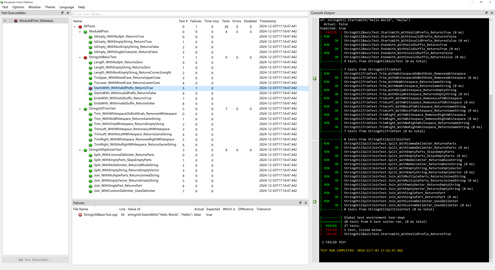

一个基于 Qt5 的自动测试运行器和 Google Test 单元测试的图形用户界面

## 自动测试运行

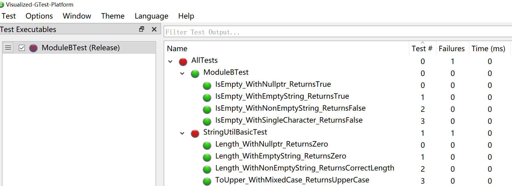

- Visualized-GTest-Platform 使用文件系统监视器检测测试的每次更改（例如，当你构建它时），并自动重新运行测试并更新所有测试用例窗口。即使在 Visualized-GTest-Platform 关闭时重新构建测试，此功能也能正常工作。
- Visualized-GTest-Platform 并行运行所有测试，为每个测试显示进度指示器。
- _注意：_ 对于耗时或耗费资源的测试，可以通过取消选中测试名称旁边的复选框来禁用自动测试运行。

## 简单的交通灯输出

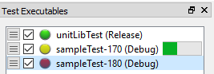

-  - 绿灯表示测试已运行，所有测试用例都通过，没有错误。
-  - 黄灯表示测试在磁盘上已更改，需要重新运行。如果测试可执行文件损坏、死锁或段错误，你可能会看到测试处于"挂起"的黄色状态。
-  - 红灯表示测试可执行文件至少有一个测试用例失败。
-  - 灰灯表示测试被禁用，_或者_ 如果自动运行被禁用，也可能表示测试输出已过期。

## 完整的控制台输出

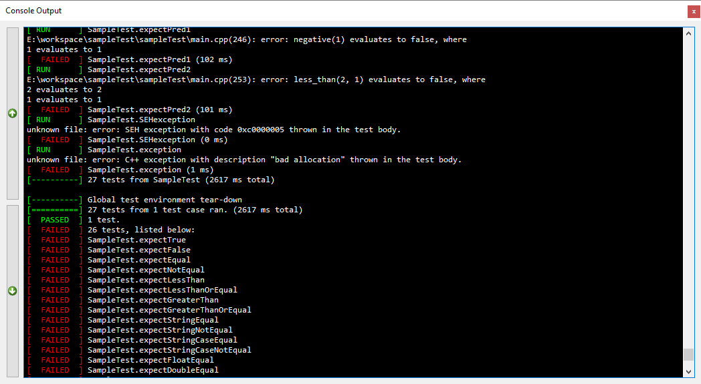

- 所有 gtest 控制台输出都被保留（包括语法高亮）并输出到内置的控制台面板，这样你就可以在获得 GUI 所有优点的同时不会丢失任何调试输出。此外，`Visualized-GTest-Platform` 还添加了其他功能，如[搜索对话框](#搜索)和[前进和后退失败导航按钮](#下一个上一个失败)。

## 完全可定制的布局

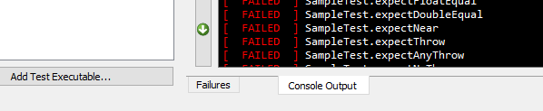

- Visualized-GTest-Platform 使用可分离的面板来显示测试可执行文件、失败和控制台，你可以将它们标签化、重新排列、分离或隐藏，以最适合你的屏幕布局。

## 明暗主题

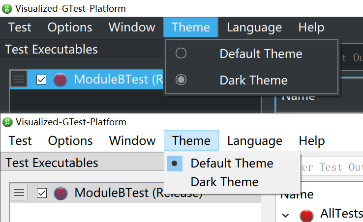

- 轻松在系统默认颜色主题和 breeze 风格的暗黑主题之间切换。

## 系统通知

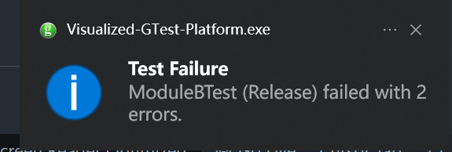

- 当测试在后台自动运行时，Visualized-GTest-Platform 会生成系统通知，让你知道是否有任何测试失败。对于自动运行时通过的测试，也可以（可选）配置通知。
- _注意：_ 手动运行的测试不会生成通知（因为你可能已经在查看输出）。

## Gtest 支持

- Visualized-GTest-Platform 支持 `gtest-1.7.0` 和 `gtest-1.8.0` 风格的输出。

# 测试可执行文件面板

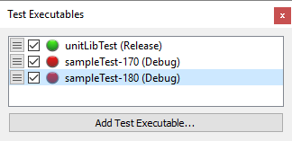

## 拖放支持

- 要添加要监视的测试可执行文件，只需将测试可执行文件拖放到 `Visualized-GTest-Platform` GUI 的任何位置即可。

## 轻松添加和删除测试

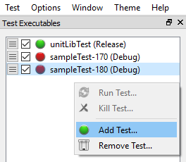

- 除了拖放之外，还可以使用 `测试可执行文件` 窗口中的右键上下文菜单轻松添加或删除测试。

## 重新运行测试

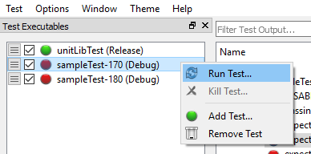

- 你可以随时通过右键单击测试并选择 `运行测试...` 来手动重新运行测试。

## 终止测试

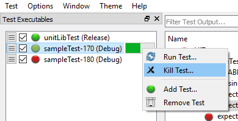

- 不小心点击运行了你的 4 小时 CPU 密集型测试？没问题！随时通过右键单击测试并选择 `终止测试...` 来取消测试。
- _提示：_ 如果 `终止测试...` 选项呈灰色，这意味着你的测试没有运行（即使它有黄色指示器）。

## gtest 命令行选项

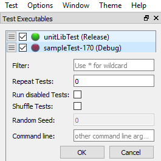

- 点击测试可执行文件名称左侧的汉堡菜单将弹出 `gtest 命令行` 对话框，允许访问直接从终端运行测试时可用的所有选项。

每个输入项的含义如下：
1. Filter (过滤器):
```bash
// 用于过滤要运行的测试用例
// 使用 * 作为通配符，例如:
// TestSuite.* - 运行 TestSuite 下的所有测试
// TestSuite.TestCase - 只运行特定的测试用例
```
2. Repeat Tests (重复测试):
```bash
// 设置测试重复运行的次数
// 0 或 1 - 运行一次
// >1 - 重复运行指定次数
// -1 - 无限循环运行
```
3. Run disabled Tests (运行禁用的测试):
```bash
// 复选框，对应 --gtest_also_run_disabled_tests 参数
// 选中时会运行那些被 DISABLED_ 标记的测试用例
```
4. Shuffle Tests (随机化测试):
```bash
// 复选框，对应 --gtest_shuffle 参数
// 选中时会随机打乱测试用例的执行顺序
```
5. Random Seed (随机种子):
```bash
// 当启用 Shuffle Tests 时生效
// 设置随机数种子，用于重现特定的测试顺序
// 0 表示使用系统时间作为种子
```
6. Command line (命令行):
```bash
// 其他命令行参数
// 可以输入任何其他 Google Test 支持的命令行选项
```
这些设置最终会被转换为 Google Test 的命令行参数：
```cpp
QStringList arguments;
if (!filter.isEmpty()) arguments << "--gtest_filter=" + filter;
if (repeat != "1") arguments << "--gtest_repeat=" + repeat;
if (runDisabled) arguments << "--gtest_also_run_disabled_tests";
if (shuffle) {
    arguments << "--gtest_shuffle";
    arguments << "--gtest_random_seed=" + QString::number(seed);
}
if(!otherArgs.isEmpty()) arguments << otherArgs;
```
这个面板提供了一个图形化的方式来配置 Google Test 的运行参数，而不需要直接在命令行中输入这些选项。

## 启用/禁用自动运行


- 频繁编译，或者有一个不想在后台运行的资源密集型测试？无论什么原因，通过取消选中测试可执行文件名称旁边的自动运行框，都可以轻松禁用自动运行。

## 测试进度

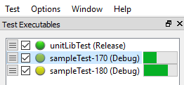

- 每个运行的测试都显示一个进度条指示器。测量的进度基于已完成的测试数量占总测试数量的比例，而不是剩余时间。

## 测试路径提示

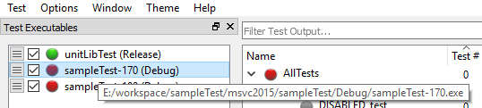

- 将鼠标悬停在任何测试可执行文件上都会显示测试的完整路径作为工具提示。这对于区分具有相同名称的多个测试很有用。在 Windows 上，`Debug` 和 `Release` 构建会自动区分。

# 测试用例窗口

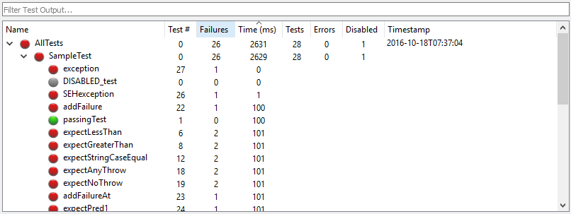

## 详细的失败信息

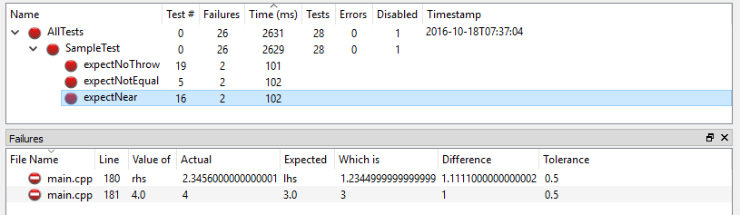

- 点击任何失败的测试用例都会在 `失败` 窗口中显示每个 `EXPECT/ASSERT` 失败的详细信息。
- _注意：_ 对于通过或禁用的测试用例，没有详细信息可用。

## 失败排序

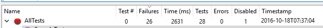

- 测试用例列表可以按任何列排序。默认排序是按顺序显示测试。要更改排序，只需点击任何列标题。再次点击标题可在升序/降序之间切换。
- _注意：_ 当前排序列由列标题上方的箭头指示（在此示例中为 `失败`）。

## 失败过滤

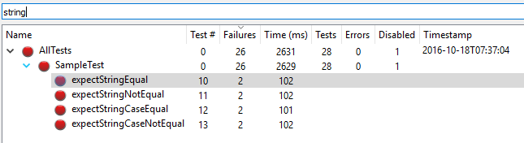

- 通过在过滤文本框中输入来过滤显示的测试用例。只会显示匹配的结果。
- _注意：_ 过滤文本编辑框也接受正则表达式过滤器！

# 失败窗口

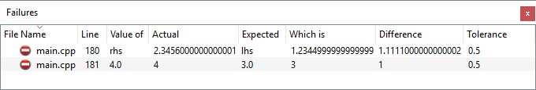

## 跳转到控制台输出

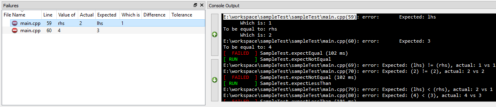

- 单击失败窗口中的任何失败将自动跳转到 gtest 控制台中的相应输出。

## 在 IDE 中打开

- 双击任何失败将自动在你的 IDE（或与文件扩展名关联的程序）中打开文件。它还会将失败的行号复制到剪贴板。在几乎所有编辑器中，你都可以使用快捷键 `Ctrl-G, Ctrl-V, ENTER` 快速跳转到失败位置。

## 完整的 GTest 错误消息

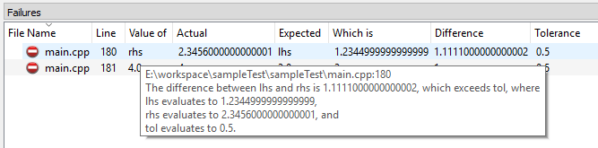

- 将鼠标悬停在任何失败上都会显示一个工具提示，其中包含原始的、未解析的 gtest 错误消息。

# 控制台窗口


## 搜索

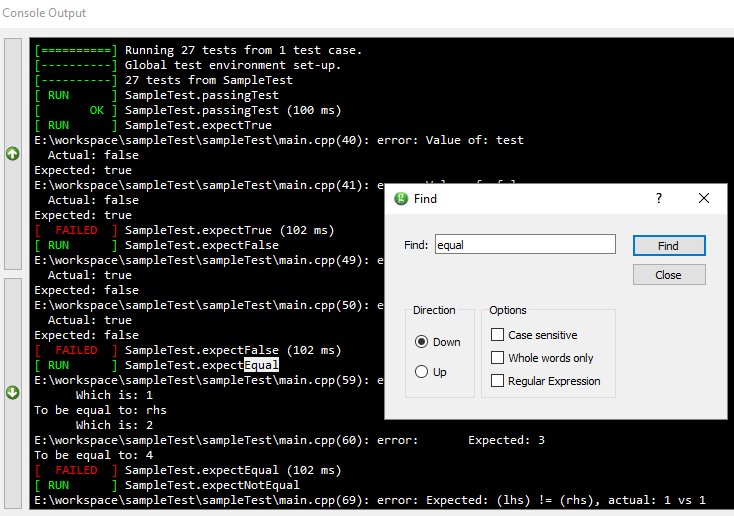

- 使用键盘快捷键 `Ctrl-F`，或通过右键单击控制台窗口并从菜单中选择来打开 `查找` 窗口。你可以使用 `查找` 对话框在控制台输出中搜索特定的失败或 `std::cout` 消息。

## 下一个/上一个失败

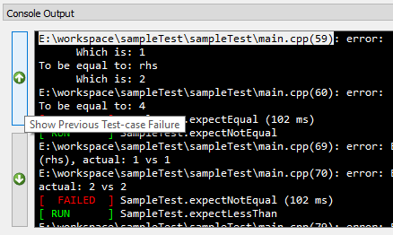

- 使用控制台窗口左侧的按钮快速滚动到下一个或上一个失败。

## 清除之前运行的输出

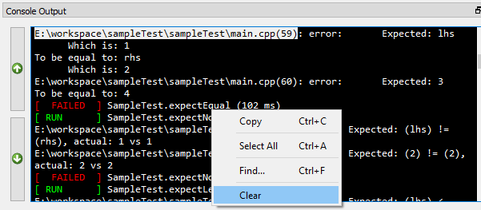

- 是你的控制台输出变得杂乱无章了吗？轻松清除它吧！

## Cout

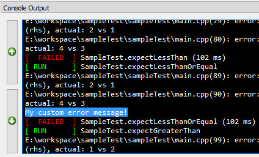

- 喜欢混合 `std::cout` 调试和你的 gtests 吗？没问题！所有的自定义错误消息都可以在控制台窗口中看到。

## 🤝 贡献

欢迎贡献！请随时提交 Pull Request。对于重大更改，请先开启一个 issue 来讨论您想要更改的内容。

## 📄 许可证

本项目采用 MIT 许可证 - 详情请参见 [LICENSE](LICENSE) 文件。

## 🌟 Star 历史

[](https://star-history.com/#lemoabc/Visualized-GTest-Platform&Date)

## 🙏 致谢

- [Google Test](https://github.com/google/googletest)
- 所有为这个项目做出贡献的人